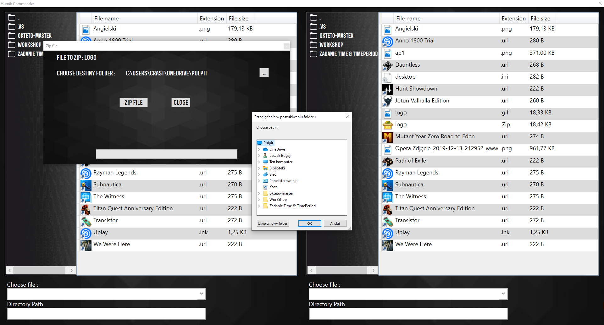
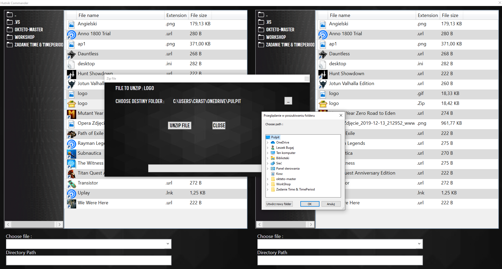
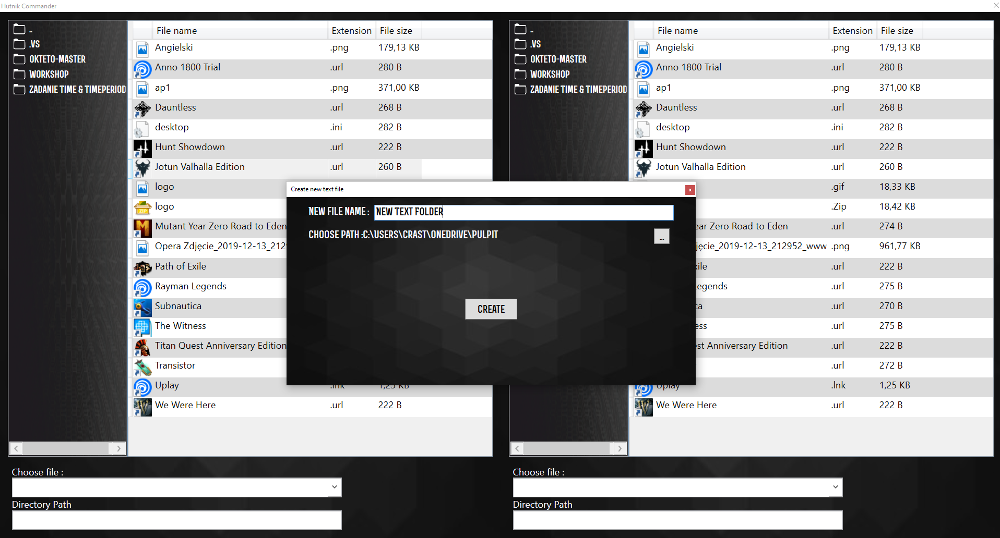
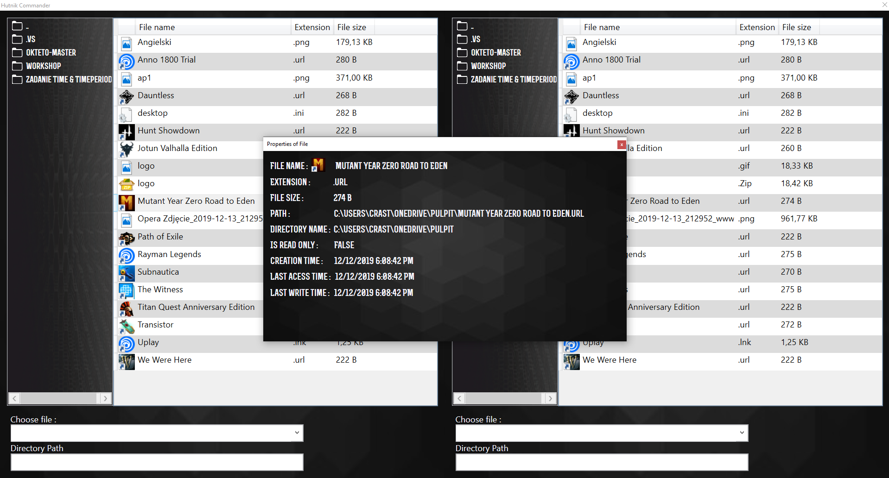

# Założenia Projektowe

Głównym założeniem naszego projektu było stworzenie aplikacji 
do zarządzania plikami na wzór programu „ Total Commander”.  
W aplikacji „ Hutnik Commander” oddajemy użytkownikowi do pracy dwa okna,
na których można otworzyć dwie różne lokalizacje, gdzie może wykonywać 
podstawowe operacje na plikach.  
Główne zadania postawione przed naszą aplikacją to: 

•	Możliwość kopiowania plików z jednej lokalizacji do drugiej zachowując plik w lokalizacji początkowej 
•	Możliwość kopiowania plików z jednej lokalizacji do drugiej usuwając plik z lokalizacji początkowej  
•	Możliwość trwałego usunięcia plików z dysku 
•	Możliwość zarchiwizowania wybranych plików do pliku *.zip 
•	Możliwość wypakowania plików *.zip do wybranej lokalizacji  
•	Możliwość sprawdzenia dla wybranego pliku właściwości takich jak np. rozmiar, format czy dokładna lokalizacja pliku  
•	Możliwość tworzenia nowych plików takich jak np. notatnik, skrót do pliku, czy nowy folder 

Powyższe funkcje aby zachować prosty i czytelny styl aplikacji zostały umieszczone w menu kontekstowym 

# Design assumptions

The main assumption of our project was to create a software management application similar to the "Total Commander" program. 
In the application "Hutnik Commander" odd applications to work two windows, which can be used two different locations where basic file operations can occur.
The main tasks set before our application for:

• The ability to copy files from one location to another while keeping the file in its original location 
• The ability to copy files from one location to another by deleting the file with the starting location 
• The ability to permanently delete files from the disk 
• The ability to archive selected files to *.zip file 
• Possibility of unpacking *.zip files  
• Possibility to check properties such as size, format and exact file location for the application 
• The ability to create new files such as a notebook, file shortcut or new folder  

Available functions available in the context menu 

## Screenshots
 
Main Window   
 
Context menu   
 
Zip   
 
UnZip   
 
NewFile   
 
Properties   

