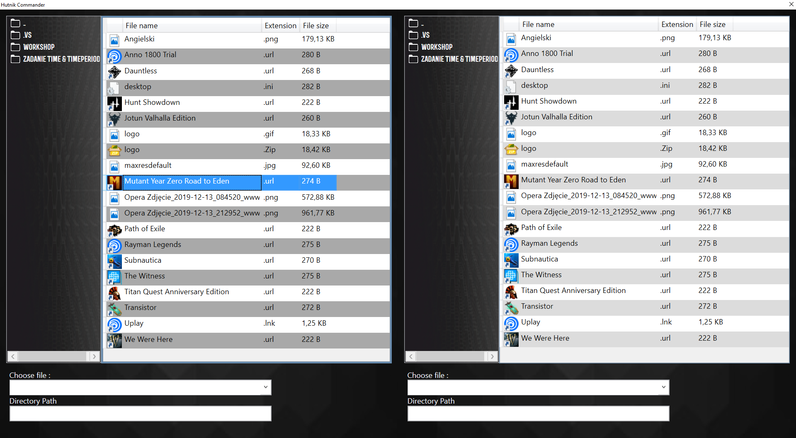
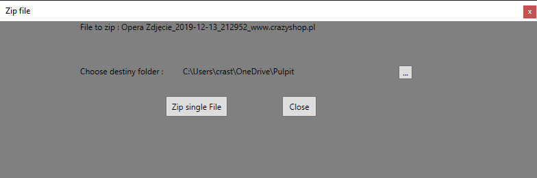
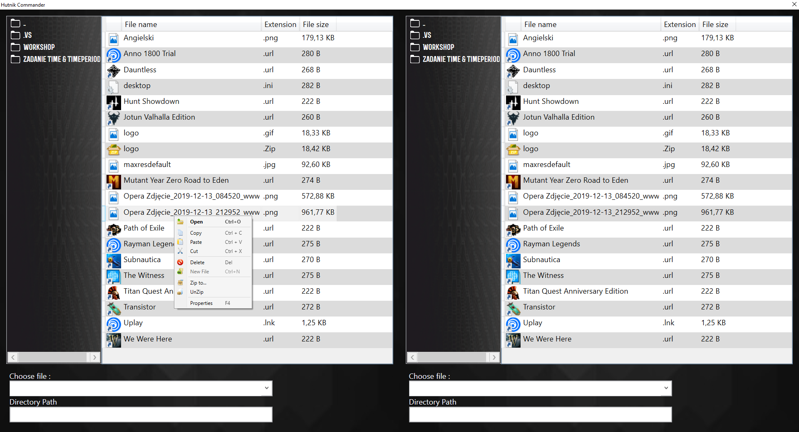

# Założenia Projektowe

Głównym założeniem naszego projektu było stworzenie aplikacji 
do zarządzania plikami na wzór programu „ Total Commander”.  
W aplikacji „ Hutnik Commander” oddajemy użytkownikowi do pracy dwa okna,
na których można otworzyć dwie różne lokalizacje, gdzie może wykonywać 
podstawowe operacje na plikach.  
Główne zadania postawione przed naszą aplikacją to: 

•	Możliwość kopiowania plików z jednej lokalizacji do drugiej zachowując plik w lokalizacji początkowej 
•	Możliwość kopiowania plików z jednej lokalizacji do drugiej usuwając plik z lokalizacji początkowej  
•	Możliwość trwałego usunięcia plików z dysku 
•	Możliwość zarchiwizowania wybranych plików do pliku *.zip 
•	Możliwość wypakowania plików *.zip do wybranej lokalizacji (w trakcie produkcji) 
•	Możliwość sprawdzenia dla wybranego pliku właściwości takich jak np. rozmiar, format czy dokładna lokalizacja pliku  
•	Możliwość tworzenia nowych plików takich jak np. notatnik, skrót do pliku, czy nowy folder (w trakcie produkcji) 

Powyższe funkcje aby zachować prosty i czytelny styl aplikacji zostały umieszczone w menu kontekstowym 

## Screenshots

